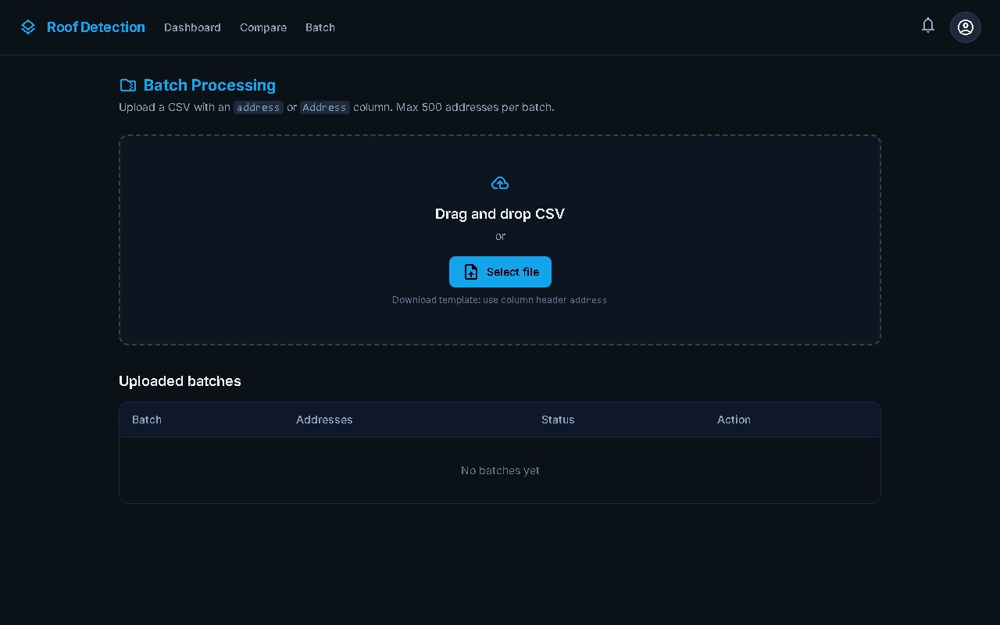

# Roof Detection

A roof segmentation tool that takes an address, fetches satellite imagery, and detects roof boundaries using a U-Net model.

## Features

- **Address to Satellite**: Enter any address to fetch Google Maps satellite imagery
- **Roof Segmentation**: U-Net model detects roof boundaries and generates polygon masks
- **Batch Processing**: Upload CSV files with multiple addresses for bulk analysis
- **Comparison View**: Compare roof detection between two properties side-by-side

## Quick Start (2-Minute Demo)

```bash
# 1. Start the backend (Python 3.10+ required)
python -m venv venv && source venv/bin/activate
pip install -r requirements.txt
cd api && python -m uvicorn main:app --reload --port 8000 &

# 2. Start the frontend (Node 18+ required)
cd ../app && npm install && npm run dev
```

Open http://localhost:5173 and enter any address. No API key required - demo mode works with sample data.

For live satellite imagery, set `GOOGLE_MAPS_API_KEY` before starting the backend.

## Screenshots

| Dashboard | Batch Processing |
|-----------|------------------|
|  |  |

## Architecture

```
┌─────────────────┐     ┌─────────────────┐     ┌─────────────────┐
│   React Frontend │────▶│   FastAPI Backend│────▶│   U-Net Model    │
│   (Vite + Tailwind)│     │   (Python)       │     │   (PyTorch + SMP)│
└─────────────────┘     └─────────────────┘     └─────────────────┘
                               │
                               ▼
                        ┌─────────────────┐
                        │  Google Maps API │
                        │  (Geocoding +    │
                        │   Satellite)     │
                        └─────────────────┘
```

## Detailed Setup

### Prerequisites

- Python 3.10+
- Node.js 18+
- Google Maps API key (optional - demo mode works without it)

### Backend Setup

```bash
# Create virtual environment
python -m venv venv
source venv/bin/activate  # On Windows: venv\Scripts\activate

# Install dependencies
pip install -r requirements.txt

# Set environment variables
export GOOGLE_MAPS_API_KEY="your-api-key"  # Optional
export MODEL_PATH="models/your-model/best.pt"  # Optional, auto-detects

# Run the API server
cd api && python -m uvicorn main:app --reload --port 8000
```

### Frontend Setup

```bash
cd app
npm install
npm run dev
```

The app will be available at http://localhost:5173

## API Endpoints

| Endpoint | Method | Description |
|----------|--------|-------------|
| `/api/geocode` | GET | Geocode an address to lat/lng |
| `/api/satellite` | GET | Get satellite tile URL |
| `/api/satellite/image` | GET | Fetch satellite image bytes |
| `/api/inference` | POST | Run roof detection on uploaded image |
| `/api/batch` | POST | Create batch job from address list |
| `/api/batch/upload` | POST | Upload CSV for batch processing |
| `/api/batch/{job_id}` | GET | Get batch job status and results |
| `/api/health` | GET | Health check endpoint |

### Example: Run Inference

```bash
curl -X POST "http://localhost:8000/api/inference" \
  -H "Content-Type: multipart/form-data" \
  -F "file=@satellite_image.png"
```

Response:
```json
{
  "mask_base64": "...",
  "polygons": [[[x1, y1], [x2, y2], ...]],
  "roof_area_px": 45600,
  "confidence": 87.3
}
```

## Model Training

> **Heads-up on the old setup.** The original `train.py` produced ~0.86 val IoU, but
> that number was inflated: train/val/test splits shared the same two source tiles
> (`tile1`/`tile2`), so the model saw near-identical geography across splits, and
> ~half the manifest entries were missing on disk. `train_v2.py` fixes this with a
> leak-free split, an external roof dataset (AIRS), a stronger base model, and honest
> held-out test metrics.

### 1. Prepare a leak-free dataset (AIRS + your tiles)

AIRS (Aerial Imagery for Roof Segmentation, CC BY 4.0) adds geographic breadth.
Download the GeoTIFF mosaics from
[Kaggle](https://www.kaggle.com/datasets/atilol/aerialimageryforroofsegmentation)
or [OpenDataLab](https://opendatalab.com/OpenDataLab/AIRS/download) and point the
prep script at them. It tiles the mosaics into 512×512 patches (windowed reads,
constant RAM), splits them by **spatial macro-block** so no patch straddles a
train/val boundary, and re-splits your existing tiles by source.

```bash
pip install -r requirements-data.txt          # adds rasterio
python scripts/prepare_airs.py \
    --airs-dir /path/to/airs \
    --existing-dir segmentation_model_data \
    --out segmentation_model_data_v2
# -> segmentation_model_data_v2/{images,masks,filenames/*_filenames_clean.txt}
# Built-in assertion guarantees no source unit appears in two splits.
```

> Your existing data has only 2 source tiles, so it can't form a held-out test set
> on its own (`tile1`→train, `tile2`→val). AIRS's separate test mosaic supplies the
> test split — that's the set `evaluate.py` measures honest accuracy on.

### 2. Fetch a remote-sensing pretrained encoder (recommended)

A U-Net++ with a Sentinel-2 self-supervised ResNet-50 encoder (SeCo) generalizes
better than ImageNet pretraining for aerial imagery.

```bash
python scripts/fetch_remote_weights.py        # SeCo-1M ResNet-50 -> pretrained/
```

### 3. Train

```bash
python train_v2.py \
    --data-root segmentation_model_data_v2 \
    --arch unetplusplus --encoder resnet50 --encoder-init seco \
    --image-size 512 --batch-size 4 --epochs 30 \
    --scheduler cosine --loss bce_dice_focal \
    --output-dir outputs_v2_unetpp_seco
```

> **VRAM.** U-Net++ + ResNet-50 at 512×512 needs **~4.1 GB at batch 4** (fits an 8 GB
> GPU). Batch 8 OOMs on 8 GB — for batch 8 use `--arch deeplabv3plus` (~3.2 GB) or
> `--image-size 384` (~4.6 GB). Add `--no-test-eval` if the final held-out eval OOMs,
> then run `evaluate.py` separately.

Improvements over `train.py`: U-Net++/DeepLabV3+ architecture choice, RS-SSL
encoder init, cosine LR schedule, AMP + grad clipping, stronger augmentation
(RandomResizedCrop + color jitter + noise), BCE+Dice+Focal loss for class
imbalance, **threshold tuning on validation**, and a final **test-set evaluation**
(`metrics.json`). The checkpoint stays a drop-in for the app — `api/inference.py`
reads the architecture and tuned threshold from `best.pt`.

A/B alternatives: `--arch unet|unetplusplus|deeplabv3plus`,
`--encoder-init imagenet|seco|seco100k|none|<path>`, `--image-size 256|512`.

### 4. Evaluate honestly

```bash
python evaluate.py --checkpoint outputs_v2_unetpp_seco/best.pt \
    --data-root segmentation_model_data_v2 --split test           # held-out AIRS
python evaluate.py --checkpoint outputs_v2_unetpp_seco/best.pt \
    --data-root segmentation_model_data_v2 --split val --tta --sweep
```

The legacy trainer is still available as `python train.py ...` for comparison.

## Demo Mode

If no `GOOGLE_MAPS_API_KEY` is set, the app runs in demo mode using sample data. This allows testing the UI without API access.

## Project Structure

```
roof_detection/
├── api/
│   ├── main.py           # FastAPI application
│   ├── inference.py      # Model inference code
│   └── geocode_satellite.py  # Google Maps integration
├── app/
│   ├── src/
│   │   ├── pages/        # React page components
│   │   ├── components/   # Shared UI components
│   │   └── api.js        # API client
│   └── public/
│       └── samples/      # Demo mode assets
├── models/               # Trained model checkpoints
├── train.py              # Model training script
├── dataset.py            # PyTorch dataset definition
└── requirements.txt      # Python dependencies
```

## Development

### Run Tests

```bash
# Backend tests
pytest api/tests/ -v

# Frontend tests
cd app && npm test
```

### Docker

```bash
docker-compose up --build
```

## License

MIT License
