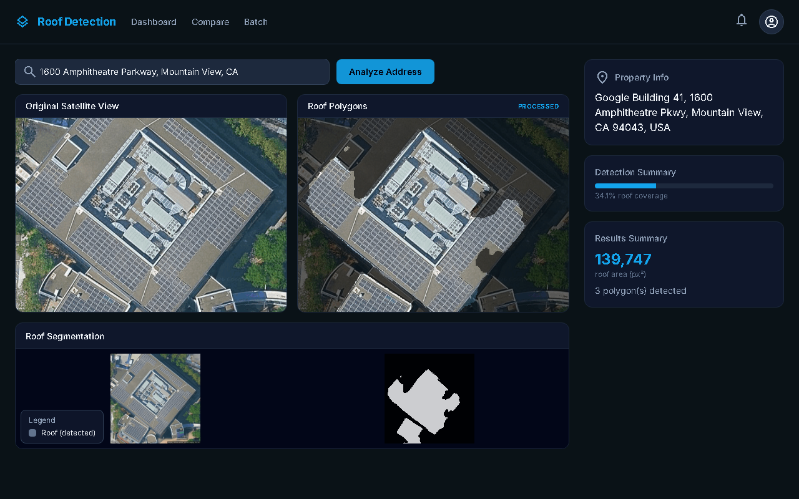

# Roof Detection

A roof segmentation tool that takes an address, fetches satellite imagery, and detects roof boundaries using a U-Net model.

## Features

- **Address to Satellite**: Enter any address to fetch Google Maps satellite imagery
- **Roof Segmentation**: U-Net model detects roof boundaries and generates polygon masks
- **Batch Processing**: Upload CSV files with multiple addresses for bulk analysis
- **Comparison View**: Compare roof detection between two properties side-by-side

## Quick Start (2-Minute Demo)

```bash
# 1. Start the backend (Python 3.10+ required)
python -m venv venv && source venv/bin/activate
pip install -r requirements.txt
cd api && python -m uvicorn main:app --reload --port 8000 &

# 2. Start the frontend (Node 18+ required)
cd ../app && npm install && npm run dev
```

Open http://localhost:5173 and enter any address. No API key required - demo mode works with sample data.

For live satellite imagery, set `GOOGLE_MAPS_API_KEY` before starting the backend.

Open http://localhost:5173 and enter any address. No API key required - demo mode works with sample data.

For live satellite imagery, set `GOOGLE_MAPS_API_KEY` before starting the backend.

## Screenshots

| Dashboard | Batch Processing |
|-----------|------------------|
|  |  |

> **Note:** To add screenshots, capture the UI and save to `docs/` directory:
> - `docs/dashboard.png` - Main analysis view with satellite imagery and roof mask
> - `docs/batch-results.png` - Batch results table showing multiple addresses

## Architecture

```
┌─────────────────┐     ┌─────────────────┐     ┌─────────────────┐
│   React Frontend │────▶│   FastAPI Backend│────▶│   U-Net Model    │
│   (Vite + Tailwind)│     │   (Python)       │     │   (PyTorch + SMP)│
└─────────────────┘     └─────────────────┘     └─────────────────┘
                               │
                               ▼
                        ┌─────────────────┐
                        │  Google Maps API │
                        │  (Geocoding +    │
                        │   Satellite)     │
                        └─────────────────┘
```

## Quick Start

### Prerequisites

- Python 3.10+
- Node.js 18+
- Google Maps API key (optional - demo mode works without it)

### Backend Setup

```bash
# Create virtual environment
python -m venv venv
source venv/bin/activate  # On Windows: venv\Scripts\activate

# Install dependencies
pip install -r requirements.txt

# Set environment variables
export GOOGLE_MAPS_API_KEY="your-api-key"  # Optional
export MODEL_PATH="models/your-model/best.pt"  # Optional, auto-detects

# Run the API server
cd api && python -m uvicorn main:app --reload --port 8000
```

### Frontend Setup

```bash
cd app
npm install
npm run dev
```

The app will be available at http://localhost:5173

## API Endpoints

| Endpoint | Method | Description |
|----------|--------|-------------|
| `/api/geocode` | GET | Geocode an address to lat/lng |
| `/api/satellite` | GET | Get satellite tile URL |
| `/api/satellite/image` | GET | Fetch satellite image bytes |
| `/api/inference` | POST | Run roof detection on uploaded image |
| `/api/batch` | POST | Create batch job from address list |
| `/api/batch/upload` | POST | Upload CSV for batch processing |
| `/api/batch/{job_id}` | GET | Get batch job status and results |
| `/api/health` | GET | Health check endpoint |

### Example: Run Inference

```bash
curl -X POST "http://localhost:8000/api/inference" \
  -H "Content-Type: multipart/form-data" \
  -F "file=@satellite_image.png"
```

Response:
```json
{
  "mask_base64": "...",
  "polygons": [[[x1, y1], [x2, y2], ...]],
  "roof_area_px": 45600,
  "confidence": 87.3
}
```

## Model Training

The roof detection model is a U-Net with ResNet34 encoder trained on satellite imagery:

```bash
# Prepare your dataset in data/ directory
# Expected structure: data/images/ and data/masks/

python train.py --data_dir data/ --encoder resnet34 --epochs 50
```

See `train.py` for full training options.

## Demo Mode

If no `GOOGLE_MAPS_API_KEY` is set, the app runs in demo mode using sample data. This allows testing the UI without API access.

## Project Structure

```
roof_detection/
├── api/
│   ├── main.py           # FastAPI application
│   ├── inference.py      # Model inference code
│   └── geocode_satellite.py  # Google Maps integration
├── app/
│   ├── src/
│   │   ├── pages/        # React page components
│   │   ├── components/   # Shared UI components
│   │   └── api.js        # API client
│   └── public/
│       └── samples/      # Demo mode assets
├── models/               # Trained model checkpoints
├── train.py              # Model training script
├── dataset.py            # PyTorch dataset definition
└── requirements.txt      # Python dependencies
```

## Development

### Run Tests

```bash
# Backend tests
pytest api/tests/ -v

# Frontend tests
cd app && npm test
```

### Docker

```bash
docker-compose up --build
```

## License

MIT License
